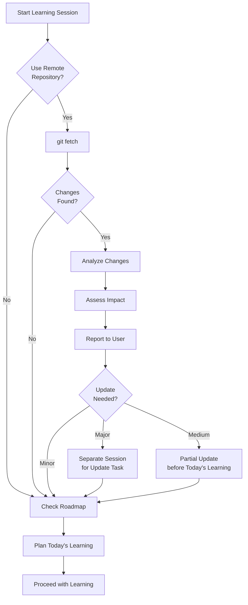

# VibeLearn AI

🌐 **Language / 언어**: [한국어](README.md) | [English](README.en.md)

**Version**: 2.0
**Date**: 2025-12-28
**Author**: Catch Up AI Channel

> 🚀 **Quick Start**: Refer to [GETTING_STARTED.en.md](GETTING_STARTED.en.md)!

---

## 📚 Overview

**VibeLearn AI** is a learning methodology that systematically learns new technologies, frameworks, and projects using AI, and turns the outputs generated in the process into high-quality textbooks that other learners can utilize.

### Core Philosophy

> **"Learn with AI, structure what you've learned, and pave the way for the next learner."**

- **AI Collaboration-centric**: Efficient learning by utilizing AI as a learning partner
- **Structured Process**: Track learning with clear steps and deliverables
- **Knowledge Reuse**: The learning process itself becomes a textbook for others
- **Continuous Improvement**: Maintained up-to-date through Continuous Vibe Learning (CVL)
- **Pragmatism**: Sets a practical learning scope suitable for the AI era

---

## 🎯 Goals of the Methodology

### 1. For the Individual Learner
- **Fast Learning**: Efficient learning process using AI
- **Deep Understanding**: Focus on concepts and application rather than rote memorization
- **Practical Application**: Immediately applicable through practice-oriented learning
- **Metacognition**: Improvement of the learning method itself through retrospectives

### 2. For the Learning Outputs
- **Reusable**: A textbook that other learners can use as is
- **Structured**: Systematic folder structure and naming conventions
- **Up-to-date**: Tracks and updates changes through the CVL process
- **Verified Content**: Information verified through actual practice

### 3. For the Community
- **Knowledge Sharing**: Individual learning becomes a community asset
- **Collaboration**: Easy collaboration for those who have learned with the same methodology
- **Standardization**: Easy to understand learning materials with a consistent structure

---

## 🏗️ Structure of the Methodology

### VibeLearn AI Overall Structure

```
VibeLearn AI/
├── README.en.md                 # Methodology description (this file)
├── GETTING_STARTED.en.md        # Quick start guide
├── templates/                  # Template files
│   ├── topic_starter.en.md       # Topic start template
│   ├── roadmap_prompt_template.en.md
│   └── daily_learning_prompt.en.md
├── VibeLearn AI_Development/         # VibeLearn AI's own development history
│   └── vl_worklog/
└── [Topic Folders]/            # Each learning Topic
    ├── topic_info.md
    ├── vl_prompts/
    ├── vl_roadmap/
    ├── vl_worklog/
    ├── vl_materials/
    └── 01-ModuleName/
```

### Topic Folder Structure (Created during learning)

```
[TopicName]/
├── topic_info.md               # Topic information (copy of topic_starter.md)
├── vl_prompts/                 # Prompt files
│   ├── roadmap_prompt.md       # Prompt with Topic information injected
│   └── daily_learning_prompt.md
├── vl_roadmap/                 # Overall learning roadmap
│   └── YYYYMMDD_RoadMap_[Topic].md
├── vl_worklog/                 # Daily learning work log
│   ├── YYYYMMDD_M1_[Topic].md
│   └── ...
├── vl_materials/               # Reference materials (Optional)
└── 01-ModuleName/              # Learning outputs (textbook)
    ├── README.md
    ├── concepts/
    ├── examples/
    └── guides/
```

### Explanation of Core Components

#### 1. **templates/** Folder
- **Purpose**: Templates used when starting a new Topic
- **Core Files**:
  - `topic_starter.md`: Template for entering Topic information
  - `roadmap_prompt_template.md`: Template for generating a Roadmap prompt
  - `daily_learning_prompt.md`: Prompt for daily learning planning

**Features**:
- Topic-agnostic (reusable for any subject)
- Copied and customized for each Topic
- Acts as the core engine of the methodology

#### 2. **[TopicName]/vl_prompts/** Folder
- **Purpose**: Stores prompt files for the corresponding Topic
- **Creation Method**: Copied from templates/ and injected with Topic information
- **Core Files**:
  - `roadmap_prompt.md`: Roadmap generation prompt already filled with Topic information
  - `daily_learning_prompt.md`: General-purpose daily learning prompt

**Role**:
- Collaboration interface with AI
- Supports systematic learning planning

#### 3. **[TopicName]/vl_roadmap/** Folder
- **Purpose**: Stores the overall learning roadmap for the Topic
- **Filename Convention**: `YYYYMMDD_RoadMap_[TopicName].md`
- **Contents**:
  - Learning module structure (M1, M2, M3, ...)
  - Learning objectives and estimated time for each module
  - Difficulty level and required prerequisites
  - DoD (Definition of Done)
  - Self-Assessment

**Role**:
- Compass for the entire learning process
- Referenced at every learning session
- `vl_` prefix indicates a folder dedicated to the methodology

#### 4. **[TopicName]/vl_worklog/** Folder
- **Purpose**: Records daily learning work logs and progress
- **Filename Convention**: `YYYYMMDD_MX_[TopicName].md`
  - e.g., `20251228_M1_Docker-Basics.md`
  - e.g., `20251229_M2_Docker-Basics.md`

**Content Structure**:
```markdown
# WorkLog: [Task Title]

**Date**: YYYY-MM-DD
**Module**: M1, M2, ...
**Status**: Planning / In Progress / Completed

## 📊 Learning Objectives
- [ ] Objective 1
- [ ] Objective 2

## 📝 Learning Content
[Details of what was learned today]

## ✅ Completed Tasks
- [x] Task 1
- [x] Task 2

## ⚠️ Problems Encountered and Solutions
[Problem and resolution process]

## 💡 Key Learning Points
[Core learning takeaways]

## 🔍 Daily Retrospective
### What went well?
### What didn't go well?
### What did I learn?
### Action Items

## 🚀 Preparing for the Next Session
[What to do next]
```

**Rules**:
- Add to the same file for the same day
- Create a new file for the next day
- Explicitly link to the Roadmap (module/step)

#### 4. **NN-TopicName/** Folder (Learning Outputs)
- **Purpose**: Stores the actual learning results in textbook format
- **Folder Name Convention**: `[SequenceNumber]-[TopicName]/`
  - e.g., `01-Installation_Setup/`
  - e.g., `02-Basic_Commands/`
  - e.g., `03-Advanced_Features/`

**Sub-structure (Recommended)**:
```
01-TopicName/
├── README.md              # Topic overview and table of contents
├── concepts/              # Concept explanation documents
│   ├── concept1.md
│   └── concept2.md
├── examples/              # Practice code
│   ├── example1.py
│   └── example2.py
├── guides/                # Step-by-step guides
│   ├── installation.md
│   └── configuration.md
├── troubleshooting/       # Troubleshooting
│   └── common-issues.md
└── references/            # External references and resources
    └── useful-links.md
```

**Features**:
- **Textbook Goal**: Another learner can learn from this alone
- **Verified Content**: Verified through actual practice
- **Topic-specific Structure**: Sub-folders organized by topic
- **Various Formats**: Documents (md), code, configuration files, screenshots, etc.

---

## 🔄 Continuous Vibe Learning (CVL)

### Concept
A process for detecting changes and synchronizing learning content when the learning target is a continuously changing project or technology.

### CVL Process (At the start of each learning session)



### Impact Assessment Criteria

| Impact | Example | Work Time | Action |
|-------|------|----------|------|
| **Major** | Core architecture change, major API change | 2-4 hours | Separate update session |
| **Medium** | New feature addition, function name change | 30-60 minutes | Handle before today's learning |
| **Minor** | Documentation update, minor bug fix | 5 minutes | Record as a note in WorkLog |

### CVL WorkLog Entry
```markdown
## 🔄 Continuous Vibe Learning - Repository Synchronization

**Sync Time**: 2025-12-14 09:00
**Remote Commit**: abc1234 - "Add new feature X"
**Previous Local**: def5678 - "Previous version"

### Key Changes
1. Added new feature X
2. Refactored module Y

### Learning Material Updates
- [ ] 01-Basics: No changes
- [x] 02-Advanced: Added section for feature X
- [ ] WorkLog: Noted for reference

### Impact on Today's Learning
- Feature X will be covered in M5, so no current impact.
```

---

## 🔍 Retrospective Mechanism

### 3-Stage Retrospective Structure

#### 1. Daily Retrospective (At the end of each day's learning)
- **Location**: Within the day's WorkLog file
- **Duration**: 5-10 minutes
- **Content**:
  - What went well?
  - What didn't go well?
  - What did I learn?
  - Action Items
  - Tomorrow's Focus

#### 2. Module Retrospective (Upon completion of each module)
- **Location**: `vl_worklog/YYYYMMDD_[ModuleName]_Retrospective.md`
- **Duration**: 15-20 minutes
- **Content**:
  - Plan vs. Actual comparison (time, difficulty)
  - Achievement of learning objectives
  - Key Learnings
  - Problems encountered and solutions
  - Suggestions for improving the methodology
  - Roadmap accuracy assessment
  - Output quality assessment
  - Preparation for the next module

#### 3. Topic Retrospective (Upon completion of the entire Topic)
- **Location**: `vl_worklog/YYYYMMDD_[Topic]_Final_Retrospective.md`
- **Duration**: 30-60 minutes
- **Content**:
  - Overall learning journey statistics
  - Evaluation of the VibeLearn AI methodology's effectiveness
  - Topic-specific characteristics and insights
  - Methodology improvements (to apply to the next Topic)
  - Textbook quality assessment of outputs

### Value of Retrospectives
- **Metacognition**: Improve the learning method itself
- **Pattern Recognition**: Discover recurring problem/success patterns
- **Methodology Evolution**: Data-driven VibeLearn AI improvement
- **Motivation**: Visualize achievement and growth

---

## ✅ Definition of Done

### Module Completion Criteria

A module is considered complete only when all the following conditions are met:

#### 1. Learning Objectives Achieved
- [ ] All learning objectives specified in the Roadmap are completed
- [ ] Core concepts are understood and documented
- [ ] Major practice items are completed

#### 2. Outputs Generated
- [ ] A textbook folder for the module is created (NN-TopicName/)
- [ ] README.md is written (topic overview)
- [ ] Core concept documents are written (at least 2)
- [ ] Practice examples are written and verified (at least 1)

#### 3. Practice Verification
- [ ] At least 3 core commands/features are executed
- [ ] Sample code is written and its operation is confirmed
- [ ] Problems encountered are resolved and documented

#### 4. WorkLog Recorded
- [ ] The day's WorkLog file is written
- [ ] The list of completed tasks is checked off
- [ ] Problems and their solutions are recorded
- [ ] Daily Retrospective is written

#### 5. Progress Tracked
- [ ] The module is marked as complete on the Roadmap
- [ ] Preparations for the next module are identified
- [ ] Overall progress is updated

### Topic Completion Criteria

The entire Topic is complete when the following conditions are met:

- [ ] All modules are complete
- [ ] At least 5 output folders are created
- [ ] An overall Topic README.md is written
- [ ] A Final Retrospective is written
- [ ] A Self-Assessment is completed
- [ ] (Optional) Published to GitHub or shared with the community

---

## 🎓 Self-Assessment

### Learning Evaluation Philosophy in the AI Era

> **"There is no need to memorize every detail. An understanding sufficient to effectively instruct an AI is enough."**

### Scope of Evaluation

#### ✅ What Humans Should Know
1. **Conceptual Understanding**
   - What the technology/project is
   - Why it is used (the problem it solves)
   - When to use it (application scenarios)
   - Differences from alternative technologies

2. **Architectural Understanding**
   - Overall structure and components
   - Relationships between major components
   - Data/control flow

3. **Practical Application Ability**
   - Basic installation and setup methods
   - 3-5 key commands/APIs
   - Common usage patterns
   - Common troubleshooting methods

4. **AI Utilization Ability**
   - Accurately conveying requirements to the AI
   - Judging the quality of AI-generated code
   - Suggesting debugging directions when problems arise

#### ❌ What Humans Don't Need to Memorize
- Detailed API parameter lists
- Complex configuration file syntax
- All edge cases
- Internal implementation details of libraries

### Self-Assessment Checklist

Self-assess the following upon completing each module:

```markdown
## Self-Assessment: [Module Name]

### 1. Conceptual Understanding (5 min)
- [ ] Can explain what this technology/feature is in 1-2 sentences
- [ ] Can explain why it's needed with examples
- [ ] Can explain the differences from similar technologies

### 2. Practical Application (10 min)
- [ ] Can perform basic installation/setup without AI help
- [ ] Can request 3 key commands from the AI
- [ ] Can implement a simple example with the AI

### 3. AI Collaboration Ability (5 min)
- [ ] Can ask the AI to write code using this technology
- [ ] Can judge whether the AI-generated code is correct
- [ ] Can suggest a debugging direction to the AI if a problem occurs

### 4. Textbook Quality (5 min)
- [ ] Others can learn from the outputs I've created
- [ ] Verified that all examples actually work
- [ ] Sufficient troubleshooting information is included

### Score
- All checked: ⭐⭐⭐⭐⭐ (Perfect)
- 10-11 checks: ⭐⭐⭐⭐ (Excellent)
- 8-9 checks: ⭐⭐⭐ (Good)
- 6-7 checks: ⭐⭐ (Needs Review)
- 5 or fewer: ⭐ (Re-learning Recommended)
```

### Practice Problem Design Principles

Self-Assessment practice problems follow these principles:

1. **AI Utilization Premise**: Problems to be solved "with AI"
2. **Concept-centric**: Confirm conceptual understanding rather than details
3. **Practicality**: Scenarios likely to be encountered in real work
4. **Short Time**: Solved within 5-10 minutes per problem

**Example Problem**:
```markdown
## Practice Problem: Create an MCP Server

**Scenario**:
You need to create an MCP server that provides a simple file-reading function.

**What you need to do**:
1. Clearly communicate the requirements to the AI
2. Review the code generated by the AI (check if the structure is correct)
3. If there are problems after running, suggest a debugging direction to the AI

**Evaluation Criteria**:
- [ ] Requested compliance with the MCP protocol from the AI
- [ ] Identified major components in the generated code (server, tools, handler)
- [ ] Confirmed normal operation after execution

**Allowed Time**: 10 minutes (including AI assistance)
```

---

## 📂 Naming Convention

### Folder Names

| Folder Type | Rule | Example |
|----------|------|------|
| VibeLearn AI-specific folder | `vl_` prefix + lowercase | `vl_prompts/`, `vl_roadmap/`, `vl_worklog/` |
| Output Folder | `NN-TopicName/` | `01-Setup/`, `02-Basics/` |
| Subfolder | lowercase, hyphen | `concepts/`, `troubleshooting/` |

### File Names

| File Type | Rule | Example |
|----------|------|------|
| Roadmap | `YYYYMMDD_RoadMap_[Topic].md` | `20251214_RoadMap_MCP.md` |
| WorkLog | `YYYYMMDD_[TaskContent].md` | `20251214_Day1_Setup.md` |
| Prompt | `YYYYMMDD_[PromptName].md` | `20251121_Daily_Learning_Prompt.md` |
| Retrospective | `YYYYMMDD_[Module]_Retrospective.md` | `20251220_M7_Retrospective.md` |
| Output File | Free (clear description) | `installation-guide.md`, `example1.py` |

### Date Format
- **YYYYMMDD**: Use this format for all dates
- e.g., `20251214` (December 14, 2025)

---

## 🚀 Learning Process (Step-by-Step)

### Phase 0: Preparation

1. **Select a Topic**
   - Decide on the technology/project to learn
   - Clarify the learning purpose and goals

2. **Create Project Folder**
   ```bash
   mkdir [Topic]_Project
   cd [Topic]_Project
   mkdir vl_prompts vl_roadmap vl_worklog
   ```

3. **Prepare General-purpose Prompts**
   - Create `vl_prompts/roadmap_prompt.md`
   - Create `vl_prompts/daily_learning_prompt.md`
   - (Optional) CVL-related prompts

### Phase 1: Establish Roadmap

1. **Generate Roadmap**
   - Pass the Roadmap Prompt to the AI
   - Provide Topic information
   - Save the generated Roadmap to `vl_roadmap/YYYYMMDD_RoadMap_[Topic].md`

2. **Review and Adjust Roadmap**
   - Check if the learning scope is appropriate
   - Adjust module structure and order
   - Review the feasibility of the estimated time

### Phase 2: Daily Learning Cycle

**Repeat daily:**

```
1. Start Learning (10-15 min)
   ├─ CVL process (if needed)
   ├─ Check previous WorkLog
   ├─ Refer to Roadmap
   └─ Plan today's learning

2. Proceed with Learning (1-3 hours)
   ├─ Learn concepts and document
   ├─ Practice (core commands/features)
   ├─ Write example code
   └─ Save in the output folder

3. Write WorkLog (ongoing)
   ├─ Record tasks in real-time
   ├─ Problems and solutions
   └─ Update checklists

4. End Learning (10 min)
   ├─ Write Daily Retrospective
   ├─ Record preparations for the next session
   └─ (Optional) Git commit
```

### Phase 3: Module Completion

1. **Write Module Retrospective**
   - Compare plan vs. actual
   - Summarize key learnings
   - Identify areas for improvement

2. **Self-Assessment**
   - Check the checklist
   - (Optional) Solve practice problems

3. **Update Roadmap**
   - Mark the module as complete
   - Adjust subsequent modules if necessary

### Phase 4: Topic Completion

1. **Write Final Retrospective**
   - Summarize the entire journey
   - Evaluate the effectiveness of the methodology
   - Improvements for the next Topic

2. **Final Review of Outputs**
   - Check for textbook quality
   - Verify links and examples
   - Write/update README

3. **Share (Optional)**
   - Make public on GitHub
   - Share with the community
   - Write a blog post

---

## 🛠️ Tools and Environment

### Required Tools
- **AI Assistant**: Claude, ChatGPT, Copilot, etc.
- **Text Editor**: VS Code, Cursor, etc. (with Markdown support)
- **Git**: Version control (optional)

### Recommended Tools
- **Mermaid**: For creating diagrams
- **Markdown Preview**: To preview documents
- **Git**: For version control and collaboration

### Environment Setup
```bash
# Git setup (optional)
git init
git add .
git commit -m "Initial VibeLearn AI structure"

# .gitignore setup
echo ".env" >> .gitignore
echo "__pycache__/" >> .gitignore
echo "*.pyc" >> .gitignore
```

---

## 📊 Success Metrics

### Quantitative Metrics

| Metric | Measurement Method | Target |
|------|----------|------|
| Learning Completion Rate | Completed Modules / Total Modules | 100% |
| Number of Outputs | Number of folders/files created | At least 1 per module |
| WorkLog Writing Days | Number of days studied | Entire learning period |
| Practice Ratio | Practice Items / Total Items | >50% |
| Retrospective Completion Rate | Retrospectives written / Learning sessions | >80% |

### Qualitative Metrics

| Metric | Evaluation Criteria |
|------|----------|
| Understanding | Self-Assessment score (⭐ 4 or more) |
| Output Quality | Usable by other learners |
| Methodology Mastery | Natural application of the VibeLearn AI process |
| Practicality | Ability to apply learned content to real work |

---

## 🌟 Advantages of VibeLearn AI

### 1. Learner's Perspective
- ✅ **Structured Learning**: Clear steps and processes
- ✅ **Time Efficiency**: Increased learning speed with AI
- ✅ **Deep Understanding**: Embodied learning through practice
- ✅ **Sustainability**: Improved learning method through retrospectives
- ✅ **Portfolio**: The learning process itself is the result

### 2. Output's Perspective
- ✅ **Reusable**: A starting point for other learners
- ✅ **Verified Information**: Verified through practice
- ✅ **Up-to-date**: Continuously updated with CVL
- ✅ **Systematic**: Consistent structure and naming conventions

### 3. Community Perspective
- ✅ **Knowledge Accumulation**: Individual learning becomes a collective asset
- ✅ **Ease of Collaboration**: Smooth communication with the same methodology
- ✅ **Standardization**: Easy to understand and use learning materials

---

## ⚠️ Cautions and Constraints

### Do's (Recommended)
- ✅ Write a WorkLog every day
- ✅ Practice core features without fail
- ✅ Improve through retrospectives
- ✅ Maintain textbook quality of outputs
- ✅ Follow the CVL process (if necessary)

### Don'ts (To be avoided)
- ❌ Writing documents but skipping practice
- ❌ Trying to memorize all the details
- ❌ Learning without producing outputs
- ❌ Skipping retrospectives
- ❌ Neglecting outdated information

### Constraints
- Requires initial setup time (30 min - 1 hour)
- Requires a habit of consistent recording
- Requires adherence to folder structure and naming conventions
- Requires access to AI tools

---

## 🔮 Future Development Direction

### Version 1.x Plan
- [ ] Apply to various Topics and collect feedback
- [ ] Build a Self-Assessment question bank
- [ ] Refine general-purpose prompt templates

### Version 2.x Plan (In Progress)
- [x] Redesign with templates/ folder structure
- [x] topic_starter.md template system
- [x] GETTING_STARTED.md quick start guide
- [x] Independent folder structure per Topic
- [ ] Develop automation scripts (optional)
- [ ] VibeLearn AI CLI tool (future)
- [ ] Web-based dashboard (future)

### Community
- [ ] Establish a GitHub Organization
- [ ] Learning material sharing platform
- [ ] Monthly learning challenges

---

## 📚 References

### Related Methodologies
- Agile Learning
- Zettelkasten (Knowledge Management)
- Learning in Public
- Continuous Learning

### Recommended Reading
- "How to Take Smart Notes" - Sönke Ahrens
- "The Pragmatic Programmer" - Andrew Hunt, David Thomas
- "Atomic Habits" - James Clear

---

## 📞 Contact

**Catch Up AI Channel**
- Website: https://www.catchupai.net
- YouTube: https://www.youtube.com/@catchupai/
- Email: solkit70@gmail.com
- GitHub (Methodology Template): https://github.com/solkit70/VibeLearn-AI.git

---

## 📄 License

This methodology is shared under the **CC BY-SA 4.0** license.
- You are free to use and modify it as long as you provide attribution.
- Modified versions must also be shared under the same license.

---

**Version History**
- v1.0 (2025-12-14): Initial version released
- v2.0 (2025-12-28): Structure redesigned
  - Introduced templates/ folder system
  - Added topic_starter.md template
  - Independent folder structure per Topic
  - GETTING_STARTED.md quick start guide
  - Reorganized daily_learning_prompt.md sequence

**Created by Catch Up AI**
**Last Updated**: 2025-12-28
