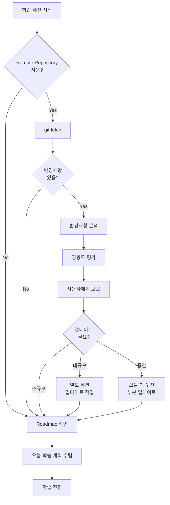

# Catch Up AI Vibe Learning Methodology (CUA_VL)

**Version**: 2.0
**Date**: 2025-12-28
**Author**: Catch Up AI Channel

> 🚀 **빠른 시작**: [GETTING_STARTED.md](GETTING_STARTED.md)를 참조하세요!

---

## 📚 개요 (Overview)

**Catch Up AI Vibe Learning Methodology (CUA_VL)**는 AI를 활용하여 새로운 기술, 프레임워크, 프로젝트를 체계적으로 학습하고, 그 과정에서 생성된 산출물을 다른 학습자들이 활용할 수 있는 고품질 교과서로 만드는 학습 방법론입니다.

### 핵심 철학

> **"AI와 함께 배우고, 배운 것을 구조화하여, 다음 학습자를 위한 길을 만든다"**

- **AI 협업 중심**: AI를 학습 파트너로 활용하여 효율적 학습
- **구조화된 프로세스**: 명확한 단계와 산출물로 학습 추적
- **지식 재사용**: 학습 과정 자체가 다른 이들을 위한 교과서
- **지속적 개선**: Continuous Vibe Learning (CVL)을 통한 최신성 유지
- **실용주의**: AI 시대에 맞는 실용적 학습 범위 설정

---

## 🎯 방법론의 목표

### 1. 학습자 개인
- **빠른 학습**: AI를 활용한 효율적 학습 프로세스
- **깊은 이해**: 단순 암기가 아닌 개념과 활용법 중심 이해
- **실전 적용**: 실습 중심 학습으로 즉시 적용 가능
- **메타 인지**: 회고를 통한 학습 방법 자체의 개선

### 2. 학습 산출물
- **재사용 가능**: 다른 학습자가 그대로 활용 가능한 교과서
- **구조화**: 체계적인 폴더 구조와 명명 규칙
- **최신성 유지**: CVL 프로세스로 변화 추적 및 업데이트
- **검증된 내용**: 실제 실습을 통해 검증된 정보

### 3. 커뮤니티
- **지식 공유**: 개인의 학습이 커뮤니티 자산으로
- **협업**: 같은 방법론으로 학습한 이들의 쉬운 협업
- **표준화**: 일관된 구조로 학습 자료 이해 용이

---

## 🏗️ 방법론 구조

### CUA_VL 전체 구조

```
CUA_VL/
├── README.md                    # 방법론 설명서 (이 파일)
├── GETTING_STARTED.md          # 빠른 시작 가이드
├── templates/                  # 템플릿 파일들
│   ├── topic_starter.md        # Topic 시작 템플릿
│   ├── roadmap_prompt_template.md
│   └── daily_learning_prompt.md
├── CUA_VL_Development/         # CUA_VL 자체 개발 기록
│   └── vl_worklog/
└── [Topic 폴더들]/             # 각 학습 Topic
    ├── topic_info.md
    ├── vl_prompts/
    ├── vl_roadmap/
    ├── vl_worklog/
    ├── vl_materials/
    └── 01-ModuleName/
```

### Topic 폴더 구조 (학습 시 생성됨)

```
[TopicName]/
├── topic_info.md               # Topic 정보 (topic_starter.md 복사)
├── vl_prompts/                 # 프롬프트 파일들
│   ├── roadmap_prompt.md       # Topic 정보 주입된 프롬프트
│   └── daily_learning_prompt.md
├── vl_roadmap/                 # 전체 학습 로드맵
│   └── YYYYMMDD_RoadMap_[Topic].md
├── vl_worklog/                 # 일별 학습 작업 로그
│   ├── YYYYMMDD_M1_[Topic].md
│   └── ...
├── vl_materials/               # 참조 자료 (Optional)
└── 01-ModuleName/              # 학습 산출물 (교과서)
    ├── README.md
    ├── concepts/
    ├── examples/
    └── guides/
```

### 핵심 구성 요소 설명

#### 1. **templates/** 폴더
- **목적**: 새 Topic 시작 시 사용하는 템플릿들
- **핵심 파일**:
  - `topic_starter.md`: Topic 정보 입력 템플릿
  - `roadmap_prompt_template.md`: Roadmap 생성 프롬프트 템플릿
  - `daily_learning_prompt.md`: 매일 학습 계획 수립 프롬프트

**특징**:
- Topic-agnostic (모든 주제에 재사용 가능)
- 복사하여 각 Topic에 맞게 커스터마이징
- 방법론의 핵심 엔진 역할

#### 2. **[TopicName]/vl_prompts/** 폴더
- **목적**: 해당 Topic의 프롬프트 파일 저장
- **생성 방법**: templates/에서 복사 후 Topic 정보 주입
- **핵심 파일**:
  - `roadmap_prompt.md`: Topic 정보가 이미 채워진 로드맵 생성 프롬프트
  - `daily_learning_prompt.md`: 범용 일일 학습 프롬프트

**역할**:
- AI와의 협업 인터페이스
- 체계적인 학습 계획 수립 지원

#### 3. **[TopicName]/vl_roadmap/** 폴더
- **목적**: 해당 Topic의 전체 학습 로드맵 저장
- **파일명 규칙**: `YYYYMMDD_RoadMap_[TopicName].md`
- **내용**:
  - 학습 모듈 구조 (M1, M2, M3, ...)
  - 각 모듈의 학습 목표 및 예상 시간
  - 난이도 및 필수 사전 지식
  - DoD (Definition of Done)
  - Self-Assessment

**역할**:
- 학습 전체의 나침반
- 매 학습 세션마다 참조
- `vl_` 접두사로 방법론 전용 폴더임을 표시

#### 4. **[TopicName]/vl_worklog/** 폴더
- **목적**: 일별 학습 작업 로그 및 진행 상황 기록
- **파일명 규칙**: `YYYYMMDD_MX_[TopicName].md`
  - 예: `20251228_M1_Docker-Basics.md`
  - 예: `20251229_M2_Docker-Basics.md`

**내용 구조**:
```markdown
# WorkLog: [작업 제목]

**Date**: YYYY-MM-DD
**Module**: M1, M2, ...
**Status**: 계획 수립 / 진행 중 / 완료

## 📊 학습 목표
- [ ] 목표 1
- [ ] 목표 2

## 📝 학습 내용
[당일 학습한 내용 상세]

## ✅ 완료한 작업
- [x] 작업 1
- [x] 작업 2

## ⚠️ 발생한 문제와 해결
[문제 및 해결 과정]

## 💡 학습 포인트
[핵심 학습 내용]

## 🔍 Daily Retrospective
### What went well?
### What didn't go well?
### What did I learn?
### Action Items

## 🚀 다음 세션 준비
[다음에 할 일]
```

**규칙**:
- 같은 날은 같은 파일에 추가 작성
- 다음 날은 새 파일 생성
- Roadmap과 연결고리 명시 (모듈/단계)

#### 4. **NN-TopicName/** 폴더 (학습 산출물)
- **목적**: 실제 학습 결과물을 교과서 형태로 저장
- **폴더명 규칙**: `[순서번호]-[주제명]/`
  - 예: `01-Installation_Setup/`
  - 예: `02-Basic_Commands/`
  - 예: `03-Advanced_Features/`

**하위 구조 (권장)**:
```
01-TopicName/
├── README.md              # 주제 개요 및 목차
├── concepts/              # 개념 설명 문서
│   ├── concept1.md
│   └── concept2.md
├── examples/              # 실습 코드
│   ├── example1.py
│   └── example2.py
├── guides/                # 단계별 가이드
│   ├── installation.md
│   └── configuration.md
├── troubleshooting/       # 문제 해결
│   └── common-issues.md
└── references/            # 외부 참조 및 리소스
    └── useful-links.md
```

**특징**:
- **교과서 목표**: 다른 학습자가 이것만으로 학습 가능
- **검증된 내용**: 실제 실습을 통해 검증
- **Topic별 구조**: 각 주제별로 하위 폴더 구성
- **다양한 형태**: 문서(md), 코드, 설정 파일, 스크린샷 등

---

## 🔄 Continuous Vibe Learning (CVL)

### 개념
학습 대상이 지속적으로 변화하는 프로젝트나 기술일 때, 변경사항을 감지하고 학습 내용을 동기화하는 프로세스

### CVL 프로세스 (매 학습 세션 시작 시)



### 영향도 평가 기준

| 영향도 | 예시 | 작업 시간 | 조치 |
|-------|------|----------|------|
| **대규모** | 핵심 아키텍처 변경, 주요 API 변경 | 2-4시간 | 별도 업데이트 세션 |
| **중간** | 새 기능 추가, 함수명 변경 | 30-60분 | 당일 학습 전 처리 |
| **소규모** | 문서 업데이트, 마이너 버그 수정 | 5분 | WorkLog에 참고사항만 기록 |

### CVL WorkLog 기록
```markdown
## 🔄 Continuous Vibe Learning - Repository 동기화

**동기화 일시**: 2025-12-14 09:00
**Remote 커밋**: abc1234 - "Add new feature X"
**이전 로컬**: def5678 - "Previous version"

### 주요 변경사항
1. 새로운 기능 X 추가
2. 모듈 Y 리팩토링

### 학습 자료 업데이트
- [ ] 01-Basics: 변경 없음
- [x] 02-Advanced: 기능 X 섹션 추가
- [ ] WorkLog: 참고사항 기록

### 오늘 학습에 미치는 영향
- 기능 X는 M5에서 다룰 예정이므로 현재 영향 없음
```

---

## 🔍 회고 (Retrospective) 메커니즘

### 3단계 회고 구조

#### 1. Daily Retrospective (매일 학습 종료 시)
- **위치**: 당일 WorkLog 파일 내
- **소요 시간**: 5-10분
- **내용**:
  - What went well? (잘된 점)
  - What didn't go well? (개선 필요)
  - What did I learn? (배운 점)
  - Action Items (개선 사항)
  - Tomorrow's Focus (내일 집중 사항)

#### 2. Module Retrospective (각 모듈 완료 시)
- **위치**: `vl_worklog/YYYYMMDD_[ModuleName]_Retrospective.md`
- **소요 시간**: 15-20분
- **내용**:
  - 계획 대비 실제 비교 (시간, 난이도)
  - 학습 목표 달성도
  - 핵심 학습 내용 (Key Learnings)
  - 발생한 문제와 해결 과정
  - 방법론 개선 제안
  - Roadmap 정확도 평가
  - 산출물 품질 평가
  - 다음 모듈 준비사항

#### 3. Topic Retrospective (전체 Topic 완료 시)
- **위치**: `vl_worklog/YYYYMMDD_[Topic]_Final_Retrospective.md`
- **소요 시간**: 30-60분
- **내용**:
  - 전체 학습 여정 통계
  - CUA_VL 방법론 효과성 평가
  - Topic별 특수성 및 인사이트
  - 방법론 개선 사항 (다음 Topic에 적용)
  - 산출물의 교과서 품질 평가

### 회고의 가치
- **메타 인지**: 학습 방법 자체를 개선
- **패턴 인식**: 반복되는 문제/성공 패턴 발견
- **방법론 진화**: 데이터 기반 CUA_VL 개선
- **동기 부여**: 성취와 성장 가시화

---

## ✅ 학습 완료 기준 (Definition of Done)

### Module 완료 기준

모든 모듈은 다음 조건을 충족해야 완료로 간주:

#### 1. 학습 목표 달성
- [ ] Roadmap에 명시된 모든 학습 목표 완료
- [ ] 핵심 개념 이해 및 문서화
- [ ] 주요 실습 항목 완료

#### 2. 산출물 생성
- [ ] 해당 모듈의 교과서 폴더 생성 (NN-TopicName/)
- [ ] README.md 작성 (주제 개요)
- [ ] 핵심 개념 문서 작성 (최소 2개)
- [ ] 실습 예제 작성 및 실행 검증 (최소 1개)

#### 3. 실습 검증
- [ ] 핵심 명령어/기능 최소 3개 실행
- [ ] 샘플 코드 작성 및 동작 확인
- [ ] 발생한 문제 해결 및 문서화

#### 4. WorkLog 기록
- [ ] 당일 WorkLog 파일 작성
- [ ] 완료한 작업 목록 체크
- [ ] 발생한 문제와 해결 방법 기록
- [ ] Daily Retrospective 작성

#### 5. 진행 상황 추적
- [ ] Roadmap에 모듈 완료 표시
- [ ] 다음 모듈 준비사항 파악
- [ ] 전체 진행률 업데이트

### Topic 완료 기준

전체 Topic은 다음 조건을 충족해야 완료:

- [ ] 모든 모듈 완료
- [ ] 최소 5개 이상의 산출물 폴더 생성
- [ ] 전체 Topic README.md 작성
- [ ] Final Retrospective 작성
- [ ] Self-Assessment 완료
- [ ] (선택) GitHub 공개 또는 커뮤니티 공유

---

## 🎓 Self-Assessment (자가 평가)

### AI 시대의 학습 평가 철학

> **"모든 디테일을 암기할 필요는 없다. AI에게 효과적으로 지시할 수 있는 수준의 이해면 충분하다."**

### 평가 범위

#### ✅ 인간이 알아야 할 것
1. **개념적 이해**
   - 해당 기술/프로젝트가 무엇인지
   - 왜 사용하는지 (문제 해결 목적)
   - 언제 사용하는지 (적용 시나리오)
   - 대안 기술들과의 차이점

2. **아키텍처 이해**
   - 전체 구조 및 구성 요소
   - 주요 컴포넌트 간 관계
   - 데이터/제어 흐름

3. **실무 활용 능력**
   - 기본 설치 및 설정 방법
   - 주요 명령어/API 3-5개
   - 일반적인 사용 패턴
   - 일반적인 문제 해결 방법

4. **AI 활용 능력**
   - AI에게 정확히 요구사항 전달
   - AI 생성 코드의 품질 판단
   - 문제 발생 시 디버깅 방향 제시

#### ❌ 인간이 암기하지 않아도 되는 것
- 상세한 API 파라미터 목록
- 복잡한 설정 파일 문법
- 모든 엣지 케이스
- 라이브러리 내부 구현 디테일

### Self-Assessment 체크리스트

각 모듈 완료 시 다음을 자가 평가:

```markdown
## Self-Assessment: [Module Name]

### 1. 개념 이해 (5분)
- [ ] 이 기술/기능이 무엇인지 1-2문장으로 설명 가능
- [ ] 왜 필요한지 예시와 함께 설명 가능
- [ ] 비슷한 기술과 차이점 설명 가능

### 2. 실무 활용 (10분)
- [ ] AI 도움 없이 기본 설치/설정 가능
- [ ] 주요 명령어 3개를 AI에게 요청 가능
- [ ] 간단한 예제를 AI와 함께 구현 가능

### 3. AI 협업 능력 (5분)
- [ ] AI에게 이 기술을 사용한 코드 작성 요청 가능
- [ ] AI가 생성한 코드의 옳고 그름 판단 가능
- [ ] 문제 발생 시 AI에게 디버깅 방향 제시 가능

### 4. 교과서 품질 (5분)
- [ ] 내가 만든 산출물로 다른 사람이 학습 가능
- [ ] 모든 예제가 실제로 동작함을 검증
- [ ] 트러블슈팅 정보가 충분히 포함

### 점수
- 모두 체크: ⭐⭐⭐⭐⭐ (완벽)
- 10-11개: ⭐⭐⭐⭐ (우수)
- 8-9개: ⭐⭐⭐ (보통)
- 6-7개: ⭐⭐ (복습 필요)
- 5개 이하: ⭐ (재학습 권장)
```

### 실습 문제 설계 원칙

Self-Assessment 실습 문제는 다음 원칙을 따름:

1. **AI 활용 전제**: "AI와 함께" 해결하는 문제
2. **개념 중심**: 디테일보다는 개념 이해 확인
3. **실용성**: 실제 업무에서 마주칠 법한 시나리오
4. **짧은 시간**: 각 문제당 5-10분 내 해결

**예시 문제**:
```markdown
## 실습 문제: MCP 서버 생성

**시나리오**:
간단한 파일 읽기 기능을 제공하는 MCP 서버를 만들어야 합니다.

**당신이 해야 할 것**:
1. AI에게 요구사항을 명확히 전달
2. AI가 생성한 코드 리뷰 (구조가 맞는지)
3. 실행 후 문제가 있다면 AI에게 디버깅 방향 제시

**평가 기준**:
- [ ] AI에게 MCP 프로토콜 준수 요청
- [ ] 생성된 코드에서 주요 컴포넌트 식별 (서버, 도구, 핸들러)
- [ ] 실행 후 정상 동작 확인

**허용 시간**: 10분 (AI 도움 포함)
```

---

## 📂 Naming Convention (명명 규칙)

### 폴더명

| 폴더 유형 | 규칙 | 예시 |
|----------|------|------|
| CUA_VL 전용 폴더 | `vl_` 접두사 + 소문자 | `vl_prompts/`, `vl_roadmap/`, `vl_worklog/` |
| 산출물 폴더 | `NN-TopicName/` | `01-Setup/`, `02-Basics/` |
| 하위 폴더 | 소문자, 하이픈 | `concepts/`, `troubleshooting/` |

### 파일명

| 파일 유형 | 규칙 | 예시 |
|----------|------|------|
| Roadmap | `YYYYMMDD_RoadMap_[Topic].md` | `20251214_RoadMap_MCP.md` |
| WorkLog | `YYYYMMDD_[작업내용].md` | `20251214_Day1_Setup.md` |
| Prompt | `YYYYMMDD_[Prompt명].md` | `20251121_Daily_Learning_Prompt.md` |
| 회고 | `YYYYMMDD_[Module]_Retrospective.md` | `20251220_M7_Retrospective.md` |
| 산출물 | 자유 (명확한 설명) | `installation-guide.md`, `example1.py` |

### 날짜 형식
- **YYYYMMDD**: 모든 날짜는 이 형식 사용
- 예: `20251214` (2025년 12월 14일)

---

## 🚀 학습 프로세스 (Step-by-Step)

### Phase 0: 준비 단계

1. **Topic 선정**
   - 학습할 기술/프로젝트 결정
   - 학습 목적 및 목표 명확화

2. **프로젝트 폴더 생성**
   ```bash
   mkdir [Topic]_Project
   cd [Topic]_Project
   mkdir vl_prompts vl_roadmap vl_worklog
   ```

3. **범용 프롬프트 준비**
   - `vl_prompts/roadmap_prompt.md` 생성
   - `vl_prompts/daily_learning_prompt.md` 생성
   - (선택) CVL 관련 프롬프트

### Phase 1: Roadmap 수립

1. **Roadmap 생성**
   - Roadmap Prompt를 AI에게 전달
   - Topic 정보 제공
   - 생성된 Roadmap을 `vl_roadmap/YYYYMMDD_RoadMap_[Topic].md`에 저장

2. **Roadmap 검토 및 조정**
   - 학습 범위 적절성 확인
   - 모듈 구조 및 순서 조정
   - 예상 시간 현실성 검토

### Phase 2: 일별 학습 사이클

**매일 반복:**

```
1. 학습 시작 (10-15분)
   ├─ CVL 프로세스 (필요 시)
   ├─ 이전 WorkLog 확인
   ├─ Roadmap 참조
   └─ 오늘 학습 계획 수립

2. 학습 진행 (1-3시간)
   ├─ 개념 학습 및 문서화
   ├─ 실습 (핵심 명령어/기능)
   ├─ 예제 코드 작성
   └─ 산출물 폴더에 저장

3. WorkLog 작성 (진행 중)
   ├─ 실시간 작업 기록
   ├─ 문제 및 해결 과정
   └─ 체크리스트 업데이트

4. 학습 종료 (10분)
   ├─ Daily Retrospective 작성
   ├─ 다음 세션 준비사항 기록
   └─ (선택) Git 커밋
```

### Phase 3: 모듈 완료

1. **Module Retrospective 작성**
   - 계획 대비 실제 비교
   - 핵심 학습 내용 정리
   - 개선 사항 도출

2. **Self-Assessment**
   - 체크리스트 점검
   - 실습 문제 풀이 (선택)

3. **Roadmap 업데이트**
   - 모듈 완료 표시
   - 필요 시 후속 모듈 조정

### Phase 4: Topic 완료

1. **Final Retrospective 작성**
   - 전체 여정 정리
   - 방법론 효과성 평가
   - 다음 Topic을 위한 개선안

2. **산출물 최종 검토**
   - 교과서 품질 확인
   - 링크 및 예제 검증
   - README 작성/업데이트

3. **공유 (선택)**
   - GitHub 공개
   - 커뮤니티 공유
   - 블로그 포스팅

---

## 🛠️ 도구 및 환경

### 필수 도구
- **AI 어시스턴트**: Claude, ChatGPT, Copilot 등
- **텍스트 에디터**: VS Code, Cursor 등 (Markdown 지원)
- **Git**: 버전 관리 (선택)

### 권장 도구
- **Mermaid**: 다이어그램 작성
- **Markdown Preview**: 문서 미리보기
- **Git**: 버전 관리 및 협업

### 환경 설정
```bash
# Git 설정 (선택)
git init
git add .
git commit -m "Initial CUA_VL structure"

# .gitignore 설정
echo ".env" >> .gitignore
echo "__pycache__/" >> .gitignore
echo "*.pyc" >> .gitignore
```

---

## 📊 성공 지표 (Success Metrics)

### 정량적 지표

| 지표 | 측정 방법 | 목표 |
|------|----------|------|
| 학습 완료율 | 완료 모듈 / 전체 모듈 | 100% |
| 산출물 개수 | 생성된 폴더/파일 수 | 모듈당 1개 이상 |
| WorkLog 작성 일수 | 학습한 날짜 수 | 전체 학습 기간 |
| 실습 비율 | 실습 항목 / 전체 항목 | 50% 이상 |
| 회고 작성률 | 회고 작성 / 학습 세션 | 80% 이상 |

### 정성적 지표

| 지표 | 평가 기준 |
|------|----------|
| 이해도 | Self-Assessment 점수 (⭐ 4개 이상) |
| 산출물 품질 | 다른 학습자가 활용 가능한 수준 |
| 방법론 숙달 | CUA_VL 프로세스 자연스럽게 적용 |
| 실용성 | 학습 내용을 실제 업무에 적용 가능 |

---

## 🌟 CUA_VL의 장점

### 1. 학습자 관점
- ✅ **구조화된 학습**: 명확한 단계와 프로세스
- ✅ **시간 효율**: AI 활용으로 학습 속도 향상
- ✅ **깊은 이해**: 실습 중심의 체화된 학습
- ✅ **지속 가능**: 회고를 통한 학습 방법 개선
- ✅ **포트폴리오**: 학습 과정 자체가 결과물

### 2. 산출물 관점
- ✅ **재사용 가능**: 다른 학습자의 시작점
- ✅ **검증된 정보**: 실습을 통해 검증
- ✅ **최신성**: CVL로 지속 업데이트
- ✅ **체계적**: 일관된 구조와 명명 규칙

### 3. 커뮤니티 관점
- ✅ **지식 축적**: 개인 학습이 공동 자산으로
- ✅ **협업 용이**: 동일 방법론으로 소통 원활
- ✅ **표준화**: 학습 자료 이해 및 활용 쉬움

---

## ⚠️ 주의사항 및 제약

### Do's (권장)
- ✅ 매일 WorkLog 작성
- ✅ 핵심 기능은 반드시 실습
- ✅ 회고를 통한 개선
- ✅ 산출물의 교과서 품질 유지
- ✅ CVL 프로세스 준수 (필요 시)

### Don'ts (지양)
- ❌ 문서만 작성하고 실습 생략
- ❌ 모든 디테일 암기 시도
- ❌ 산출물 없이 학습만 진행
- ❌ 회고 생략
- ❌ 오래된 정보 방치

### 제약사항
- 초기 설정 시간 필요 (30분-1시간)
- 꾸준한 기록 습관 필요
- 폴더 구조 및 명명 규칙 준수 필요
- AI 도구 접근 필요

---

## 🔮 향후 발전 방향

### Version 1.x 계획
- [ ] 다양한 Topic 적용 및 피드백 수집
- [ ] Self-Assessment 문제 은행 구축
- [ ] 범용 프롬프트 템플릿 고도화

### Version 2.x 계획 (진행 중)
- [x] templates/ 폴더 구조로 재설계
- [x] topic_starter.md 템플릿 시스템
- [x] GETTING_STARTED.md 빠른 시작 가이드
- [x] Topic별 독립 폴더 구조
- [ ] 자동화 스크립트 개발 (선택 사항)
- [ ] CUA_VL CLI 도구 (향후)
- [ ] 웹 기반 대시보드 (향후)

### 커뮤니티
- [ ] GitHub Organization 구축
- [ ] 학습 자료 공유 플랫폼
- [ ] 월간 학습 챌린지

---

## 📚 참고 자료

### 관련 방법론
- Agile Learning
- Zettelkasten (지식 관리)
- Learning in Public
- Continuous Learning

### 추천 읽기
- "How to Take Smart Notes" - Sönke Ahrens
- "The Pragmatic Programmer" - Andrew Hunt, David Thomas
- "Atomic Habits" - James Clear

---

## 📞 Contact

**Catch Up AI 채널**
- YouTube: https://www.youtube.com/@catchupai/
- Email: solkit70@gmail.com
- GitHub (Vibe Coding): https://github.com/solkit70/MCP_Basic_Higher_Models_GC.git
- GitHub (Methodology Template): https://github.com/solkit70/CatchUpAI_VL_Template.git

---

## 📄 License

이 방법론은 **CC BY-SA 4.0** 라이선스 하에 공유됩니다.
- 출처를 명시하면 자유롭게 사용 및 수정 가능
- 수정된 버전도 동일 라이선스로 공유 필요

---

**Version History**
- v1.0 (2025-12-14): 초기 버전 공개
- v2.0 (2025-12-28): 구조 재설계
  - templates/ 폴더 시스템 도입
  - topic_starter.md 템플릿 추가
  - Topic별 독립 폴더 구조
  - GETTING_STARTED.md 빠른 시작 가이드
  - daily_learning_prompt.md 순서 재구성

**Created by Catch Up AI**
**Last Updated**: 2025-12-28
